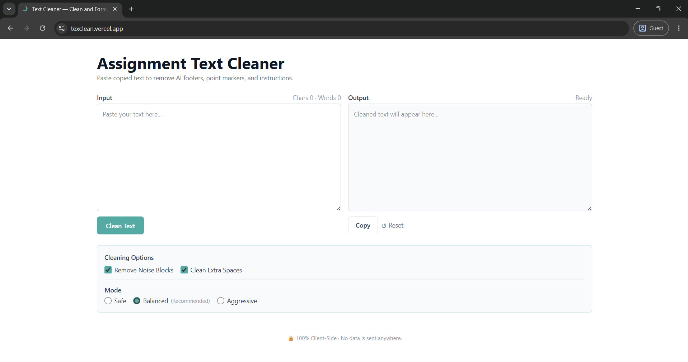
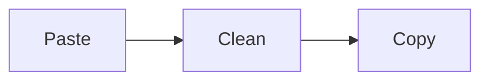

# Text Cleaner

A lightweight text cleaning and privacy focused web tool for cleaning copied text by removing unwanted noise, invisible characters, formatting artifacts, and unnecessary content.

## 🌐 Live Demo

**Website: [texclean.vercel.app](https://texclean.vercel.app/)**

  

## 📖 About

>* The Text Cleaner is a personal productivity tool created to automate repetitive text cleaning tasks.
>
>* Copied text form assignments can sometimes contain unwanted headers, invisible Unicode characters, excessive spacing, assessment-related artifacts, and inconsistent formatting. Text Cleaner provides a simple way to clean this content without manually editing it.

**The core workflow is:**

## 🎯 Aim

>To provide a simple and efficient way to clean copied text while keeping the processing private and local to the user's device.

## 🎯 Objectives
>* Automate repetitive text-cleaning tasks.
>* Remove unwanted text noise and artifacts.
>* Remove selected invisible Unicode characters.
>* Normalize unnecessary spacing and formatting.
>* Provide multiple levels of cleaning.
>* Process user text entirely on the client side.
>* Provide a simple, fast, browser-based interface.

## ✨ Features

**Three Cleaning Modes**

* **Safe** — conservative cleaning. 
* **Balanced** — removes common unwanted content. 
* **Aggressive** — performs more extensive cleaning.

## 🚀 Run the Project Locally
>Follow these steps in order.
>
>1. Clone the repository 
Open your terminal and run: 
*[git clone https://github.com/mohammed-adnan-shakeel/assignment-text-cleaner.git](https://github.com/mohammed-adnan-shakeel/assignment-text-cleaner.git)*

>2. Go into the project folder 
*cd assignment-text-cleaner*

>3. Install the dependencies 
*npm install*

This downloads and installs all the packages required by the project.

>4. Start the development server 
*npm run dev*

After running this command, the terminal should display a local URL, usually something like:

http://localhost:3000

Open that URL in your browser to view the application.

##### ⚠️ Prerequisites
Make sure you have Git and Node.js/npm installed before starting.

>Check Git: 
*git --version*
>
>Check Node.js: 
*node --version*
>
>Check npm: 
*npm --version*

Open the local development URL shown by the development server.

*The project may receive improvements and additional cleaning capabilities over time.*

## 📄 License

This project is licensed under the MIT License.

See the [LICENSE](https://github.com/mohammed-adnan-shakeel/assignment-text-cleaner/blob/main/LICENSE) file for the complete license text.

The MIT License permits use, modification, distribution, and reuse of the software, subject to its conditions.

## 👤 Author

Author: [**MOHAMMED ADNAN SHAKEEL**](https://mohammed-adnan-shakeel.github.io/)

*Created as a personal productivity and web-development project.*
